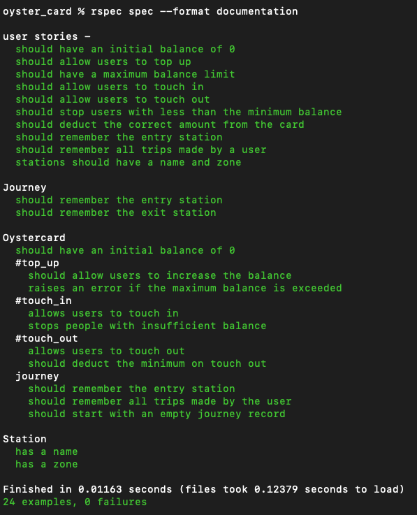

# Oyster card

```


                                -----------------------------------
                               | **********************   &&&&&&&& |                                    
                    _.---------|.--.********************   &&&&&&& |                               
                 .-'  `       .'/  `` *******************   &&&&&& |                             
              .-'           .' |    /|********* OYSTER ***   &&&&& |                            
           .-'         |   /   `.__//*********************   &&&&& |                            
        .-'           _.--/        / *********************   &&&&& |                             
       |        _  .-'   /        / **********************   &&&&& |           
       |     ._  \      /     `  / **********************   &&&&&& |                              
       |        ` .    /     `  / **********************   &&&&&&& |                              
       |         \ \ '/        / **********************   &&&&&&&& |                                
       |        - \  /        /| -----------------------------------                                    
       |        '  .'        / |                                      
       |          '         |.'|                                      
       |                    |  |                                      
       |                    |  |
       |                    |.'
       |                    /
       |                   /
       |                  /
       )                 /|
    .A/`-.              / |
   AMMMA. `-._         / /
  AMMMMMMMMA. `-.     / /
 AMMMMMMMMMMMMA. `.    /
AMMMMMMMMMMMMMMMMA.`. /
MMMMMMMMMMMMMMMMMMMA.`.
MMMMMMMMMMMMMMMMMMMMMA.`.
MMMMMMMMMMMMMMMMMMMMMMMA.
MMMMMMMMMMMMMMMMMMMMMMMMMA.
MMMMMMMMMMMMMMMMMMMMMMMMMMM
MMMMMMMMMMMMMMMMMMMMMMMMMV'

```

## Introduction

This is my solution to the week 2 exercise at Makers which is to model the Oyster card system in London. The solution builds on my learnings from the week including TDD, debugging, mocks/doubles & object oriented design. Additionally, this exercise gave me a chance to extract one class from another in line with the SRP.

## How to use

#### To set up the project

Clone this repo and then run 

```
bundle install
```
#### To create an oyster card

Open IRB and load the 'oystercard.rb' file in the 'lib' folder. Instantiate an oyster card by calling Oystercard.new. 

```
oyster_card % irb
2.7.3 :001 > require './lib/oystercard.rb'
 => true 
2.7.3 :002 > card = Oystercard.new
 => #<Oystercard:0x00007f8dfa1e09f8 @balance=0, @journeys=[]> 
```

#### Oystercard functionality

An oyster card allows users to:
- top up money 
- touch in and out of stations
- pay for journeys
- keep track of their journeys 

## Testing

All testing was completed in RSpec, a screenshot of the output is below:


## User stories

The following user stories were implemented as part of this project:
```
In order to use public transport
As a customer
I want money on my card

In order to keep using public transport
As a customer
I want to add money to my card

In order to protect my money
As a customer
I don't want to put too much money on my card

In order to pay for my journey
As a customer
I need my fare deducted from my card

In order to get through the barriers
As a customer
I need to touch in and out

In order to pay for my journey
As a customer
I need to have the minimum amount for a single journey

In order to pay for my journey
As a customer
I need to pay for my journey when it's complete

In order to pay for my journey
As a customer
I need to know where I've travelled from

In order to know where I have been
As a customer
I want to see to all my previous trips

In order to know how far I have travelled
As a customer
I want to know what zone a station is in

```

Original README [here](https://github.com/makersacademy/course/tree/main/oystercard)